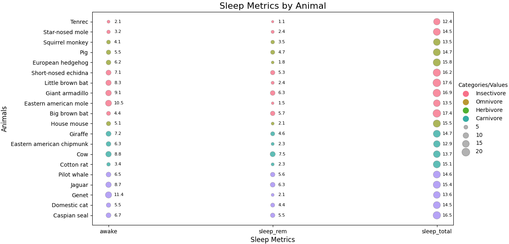

# Balloon Plot em Python

Este projeto gera um gráfico de dispersão (scatterplot) em forma de bolhas - conhecido também como: Balloon Plot - , utilizando dados fictícios de métricas de sono de animais. O gráfico permite visualizar a relação entre diferentes métricas de sono, categorizadas pela dieta dos animais (ex.: carnívoros, herbívoros, etc.). As bolhas variam em tamanho de acordo com os valores das métricas de sono, como tempo acordado, sono REM e sono total.



### 1. Importação das Bibliotecas
```python
import pandas as pd
import matplotlib.pyplot as plt
import seaborn as sns
import json
```
- **pandas**: Usada para manipulação e análise de dados.
- **matplotlib.pyplot**: Para criação dos gráficos.
- **seaborn**: Facilita a criação de gráficos com melhor visualização, em cima do matplotlib.
- **json**: Para manipulação dos dados em formato JSON.

### 2. Carregamento dos Dados
```python
with open('data.json', 'r') as f:
    data = json.load(f)
```
Aqui, eu leio os dados a partir de um arquivo JSON chamado `data.json`. O conteúdo é carregado para a variável `data`.

### 3. Conversão para DataFrame
```python
df = pd.DataFrame(data)
```
Converto os dados em um DataFrame ("tabela") do pandas.

### 4. Transformação dos Dados com `pd.melt`
```python
df_long = pd.melt(df, id_vars=['name', 'vore'], value_vars=['awake', 'sleep_rem', 'sleep_total'], 
                  var_name='variable', value_name='value')
```
Eu uso o comando `melt` para transformar os dados em formato longo, adequado para gráficos de dispersão.

### 5. Configuração do Gráfico
```python
fig, ax = plt.subplots(figsize=(10, 8))
```
Aqui, crio a figura e o eixo para o gráfico, com o tamanho definido para 10 x 8 polegadas (uma melhor resolução variará de acordo com o tamalho de sua tela).

### 6. Ordem de Tamanho dos Balões
```python
size_order = [5, 10, 15, 20]
```
Eu defino uma lista com os tamanhos que serão usados na legenda.

### 7. Gráfico de Dispersão
```python
sns.scatterplot(data=df_long, x='variable', y='name', size='value', hue='vore', 
                sizes=(20, 200), palette='husl', alpha=0.8, edgecolor='gray', legend=False, ax=ax)
```
Aqui, crio o gráfico de dispersão. As variáveis de sono ficam no eixo X, os nomes dos animais no eixo Y, e o tamanho das bolhas reflete o valor da métrica de sono.

### 8. Adicionando Valores Numéricos
```python
for index, row in df_long.iterrows():
    ax.annotate(f"{row['value']:.1f}", (row['variable'], row['name']), 
                textcoords="offset points", xytext=(10, 0), ha='left', va='center', fontsize=8, color='black')
```
Adiciono os valores das variáveis de sono diretamente ao lado direito das bolhas, para facilitar a leitura.

### 9. Título e Rótulos dos Eixos
```python
ax.set_title("Sleep Metrics by Animal", fontsize=16)
ax.set_xlabel("Sleep Metrics", fontsize=12)
ax.set_ylabel("Animals", fontsize=12)
```
Configuro o título e os rótulos dos eixos com seus respectivos tamanhos de fonte.

### 10. Personalização da Legenda
```python
legend_labels = {
    "carni": "Carnivore", "herbi": "Herbivore", "insect": "Insectivore", "omni": "Omnivore"
}

for category in df['vore'].unique():
    ax.scatter([], [], c=sns.color_palette("husl")[df['vore'].unique().tolist().index(category)], 
               label=legend_labels[category], s=100)

for size in size_order:
    ax.scatter([], [], c='gray', alpha=0.6, s=size * 10, label=f'{size}')
```
Eu crio legendas personalizadas para as categorias de dieta e para os tamanhos das bolhas.

### 11. Posicionamento da Legenda
```python
ax.legend(loc='center left', bbox_to_anchor=(1, 0.5), title="Categories/Values", 
          ncol=1, frameon=False)
```
Posiciono a legenda ao lado do gráfico para garantir que ela fique legível.

### 12. Ajuste do Layout e Salvamento da Imagem
```python
plt.tight_layout()
plt.savefig("balloon_plot.png")
plt.show()
```
Ajuste do layout, salvar o gráfico como um arquivo PNG e mostrar na tela.

### OBS: Dados de Exemplo (`data.json`)
Os dados usados são fictícios e foram criados apenas para demonstração.

```json
{
  "name": [
    "Tenrec",
    "Star-nosed mole",
    "Squirrel monkey",
    "Pig",
    "European hedgehog",
    "Short-nosed echidna",
    "Little brown bat",
    "Giant armadillo",
    "Eastern american mole",
    "Big brown bat",
    "House mouse",
    "Giraffe",
    "Eastern american chipmunk",
    "Cow",
    "Cotton rat",
    "Pilot whale",
    "Jaguar",
    "Genet",
    "Domestic cat",
    "Caspian seal"
  ],
  "vore": [
    "insect",
    "insect",
    "omni",
    "omni",
    "omni",
    "insect",
    "insect",
    "insect",
    "insect",
    "insect",
    "omni",
    "herbi",
    "herbi",
    "herbi",
    "herbi",
    "carni",
    "carni",
    "carni",
    "carni",
    "carni"
  ],
  "awake": [
    2.1, 3.2, 4.1, 5.5, 6.2, 7.1, 8.3, 9.1, 10.5, 4.4, 5.1, 7.2, 6.3, 8.8, 3.4,
    6.5, 8.7, 11.4, 5.5, 6.7
  ],
  "sleep_rem": [
    1.1, 2.4, 3.5, 4.7, 1.8, 5.3, 2.4, 6.3, 1.5, 5.7, 2.1, 4.6, 2.3, 7.5, 2.3,
    5.6, 6.3, 2.1, 4.4, 5.5
  ],
  "sleep_total": [
    12.4, 14.5, 13.5, 14.7, 15.8, 16.2, 17.6, 16.9, 13.5, 17.4, 15.5, 14.7,
    12.9, 13.7, 15.1, 14.6, 15.4, 13.6, 14.5, 16.5
  ]
}

```
---
### Repositório

O código completo está disponível em [https://github.com/dev-jonathan/balloon-plot-python/](https://github.com/dev-jonathan/balloon-plot-python/). 

